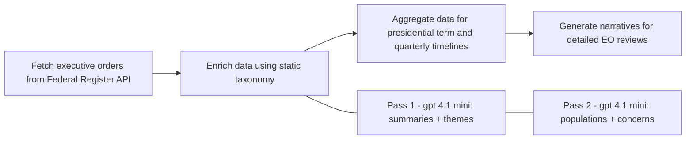

# Federal Register Analytics

Data enrichment pipeline for Federal Register executive orders. Uses OpenAI to generate summaries, themes, impact analysis, and potential concerns.

**Live site**: [What Got Signed?](https://whatgotsigned.com) (or run locally with the included Express server)

## TODO: Data Quality Improvements

For now, the todo list is about data quality. The data pipeline was done relatively quickly to get a first version out and needs a lot of work in order to generate trusted and useful data.

- [ ] Thorough spot-checking of generated data against trusted sources
- [ ] Compare summaries and impact analysis with expert policy analysis
- [ ] Improve prompts to reduce over-tagging (e.g., not every order impacts "federal employees")
- [ ] Evaluate alternative models for better accuracy/cost trade-offs
- [ ] Review and consolidate similar population categories
- [ ] Add validation step to flag potentially inaccurate enrichments for human review

## Features

- **Fetch**: Download executive orders from the Federal Register API
- **Enrich**: Use OpenAI to analyze each order with a two-pass approach using a **static taxonomy**:
  - **Pass 1** (gpt-4.1-mini): Plain-language summary and thematic categorization from static taxonomy
  - **Pass 2** (gpt-4.1-mini): Population impact analysis and potential concerns, using themes from Pass 1
  - LLM selects from a comprehensive static taxonomy (280 themes, 158 populations)
  - Suggestions for new taxonomy items are logged for human review
- **Aggregate**: Generate term summaries and timeline data (fast, no API calls)
- **Generate Narratives**: LLM-generated summaries and impact analysis per presidential term, quarter, and theme (uses OpenAI API)
- **Web Frontend**: Express server with a clean UI to browse executive orders by term, quarter, or theme

## Installation

```bash
npm install
npm run build
```

## Configuration

Copy the example environment file and add your OpenAI API key:

```bash
cp .env.example .env
```

Then edit `.env` with your API key from https://platform.openai.com/api-keys

## Usage

### Overview diagram



### 1. Fetch Executive Orders

Download executive orders for a specific year:

```bash
npm run fetch -- --year 2025
```

Fetch a range of years:

```bash
npm run fetch -- --from 2020 --to 2025
```

Or fetch a single executive order by number:

```bash
npm run fetch -- --eo 14350
```

Raw data is saved to `data/raw/executive-orders.json`.

### 2. Enrich with AI Analysis

Process orders through OpenAI for enrichment. The enrichment uses a **two-pass approach** with a **static taxonomy**:

1. **Pass 1** (gpt-4.1-mini): Generates the summary and identifies themes from the taxonomy
2. **Pass 2** (gpt-4.1-mini): Identifies impacted populations and potential concerns, using the themes from Pass 1 for context

The LLM selects tags from a comprehensive static taxonomy (`what-got-signed/data/taxonomy.json`). If the LLM suggests a new tag, it's logged to `metadata-config/executive_order_taxonomy_guide.md` for human review rather than being automatically added.

```bash
# Enrich all orders from a specific year
npm run enrich -- --year 2025

# Limit number of orders to process
npm run enrich -- --year 2025 --limit 5

# Re-process already enriched orders (includes new ones too)
npm run enrich -- --force

# Re-enrich only already-enriched orders (no new ones)
npm run enrich -- --existing-only

# Re-enrich a specific executive order
npm run enrich -- --eo 14350
```

Enriched data is saved to `data/enriched/`.

### 3. Aggregate Data

Generate term summaries and timeline data (no API calls required):

```bash
# Aggregate all data
npm run aggregate

# Aggregate for a specific president
npm run aggregate -- --president trump
```

Aggregated data is saved to `data/aggregated/`:
- `term-summaries.json` - Summary data per presidential term with top themes
- `timeline.json` - Quarterly timeline data with theme summaries

### 4. Generate Narratives

Generate LLM-powered narrative summaries for presidential terms, quarterly periods, and themes. This step uses the OpenAI API and may incur costs:

```bash
# Generate all narratives (term + quarterly + theme) -- will run for new narratives needed as well as updating stale ones
npm run generate-narratives

# Generate term narratives only
npm run generate-narratives -- --type term

# Generate quarterly narratives only
npm run generate-narratives -- --type quarterly

# Generate theme narratives only
npm run generate-narratives -- --type theme

# Generate quarterly narratives for a specific year
npm run generate-narratives -- --type quarterly --year 2025

# Generate narrative for a specific quarter
npm run generate-narratives -- --type quarterly --year 2025 --quarter 1

# Filter by president (term narratives only)
npm run generate-narratives -- --president trump

# Filter by theme (theme narratives only)
npm run generate-narratives -- --type theme --theme immigration

# Force regeneration (skip staleness checks)
npm run generate-narratives -- --force

# Check what needs updating (no regeneration, no API calls)
npm run generate-narratives -- --check
```

Outputs:
- `data/aggregated/narratives.json` - Term narratives with summary and potential impact paragraphs
- `data/aggregated/quarterly-narratives.json` - Quarterly narratives with summary and potential impact paragraphs
- `data/aggregated/theme-narratives.json` - Theme narratives with summary and potential impact paragraphs

**Smart incremental generation**: Narratives automatically detect when they're stale based on the `enriched_at` timestamps of underlying orders. If you enrich new orders in Q3 2025 with 3 themes, running `generate-narratives` will automatically regenerate only:
- The Q3 2025 quarterly narrative
- The 3 affected theme narratives
- The relevant term narrative(s)

Use `--check` to preview what would be regenerated without making API calls.

### 5. Run Full Pipeline

Run the entire pipeline (fetch, enrich, aggregate, generate narratives) for a given year:

```bash
# Run full pipeline for 2025
npm run pipeline -- --year 2025

# Skip fetching (use existing raw data)
npm run pipeline -- --year 2025 --skip-fetch

# Skip narrative generation
npm run pipeline -- --year 2025 --skip-narratives

# Force re-enrichment and narrative regeneration
npm run pipeline -- --year 2025 --force
```

### 6. Run the Web Frontend

Start the Express server to browse executive orders:

```bash
cd what-got-signed
npm install
node server.js
```

Then open http://localhost:3000 in your browser.

#### Frontend Features

- **Quarterly timeline** with horizontal scroll, filterable by year via multi-select dropdown
- **Detail pages** for presidential terms, quarters, and themes with LLM-generated narratives
- **Definitions page** with sticky category headers for browsing themes and populations
- **Back-to-top button** appears after scrolling past the viewport height
- **Friendly messaging** for themes with limited data (callout shown instead of empty sections)

#### API Security

The API automatically enforces **same-origin requests only**. This means:
- Your frontend at `whatgotsigned.com` can call `whatgotsigned.com/api/*` ✓
- Your local dev at `localhost:3000` can call `localhost:3000/api/*` ✓
- Another site at `evil-site.com` trying to call your API → blocked ✗

No configuration needed - it works automatically in both development and production.

**Adding extra allowed origins** (optional): If you need to allow additional domains (e.g., an admin dashboard on a different subdomain), set the `ALLOWED_ORIGINS` environment variable:

```bash
ALLOWED_ORIGINS=https://admin.whatgotsigned.com node server.js
```

## Data Structure

### Static Taxonomy (`what-got-signed/data/taxonomy.json`)

The main taxonomy defines all available themes and populations. The LLM selects from this taxonomy during enrichment. The frontend generates flat registries from this hierarchical structure on-the-fly:

```json
{
  "themes": {
    "national_security_defense": ["Military Readiness / Force Structure", "..."],
    "immigration": ["Border Enforcement", "Visa Policy", "..."],
    "economy_trade": ["Trade Policy / Agreements", "..."]
  },
  "impacted_populations": {
    "demographic_groups": {
      "racial_ethnic": ["African Americans / Black Americans", "..."]
    },
    "employment_sectors": {
      "government": ["Federal Employees / Civil Servants", "..."]
    }
  }
}
```

### Enriched Order

Each enriched order includes:

```json
{
  "document_number": "2025-12345",
  "executive_order_number": 14350,
  "title": "Executive Order Title",
  "signing_date": "2025-01-20",
  "president": {
    "name": "Donald Trump",
    "identifier": "donald-trump"
  },
  "html_url": "https://www.federalregister.gov/...",
  "raw_text_url": "https://www.federalregister.gov/.../raw_text",
  "enrichment": {
    "summary": "Plain-language summary of the order...",
    "theme_ids": ["immigration-enforcement", "national-security"],
    "impacted_populations": {
      "positive_ids": ["border-patrol-agents"],
      "negative_ids": ["undocumented-immigrants"]
    },
    "potential_concerns": [
      "Implementation may strain agency resources.",
      "Could face legal challenges on constitutional grounds."
    ],
    "enriched_at": "2025-01-15T10:30:00.000Z",
    "model_used": "gpt-4.1-mini"
  }
}
```

## Project Structure

```
federal-register-analytics/
├── src/
│   ├── types.ts        # TypeScript type definitions
│   ├── config.ts       # Configuration constants
│   ├── utils.ts        # Utility functions (loads taxonomy)
│   ├── fetch.ts        # Federal Register API fetching
│   ├── enrich.ts       # OpenAI enrichment logic (two-pass with static taxonomy)
│   ├── taxonomy.ts     # Taxonomy loader and formatter
│   ├── aggregate.ts    # Data aggregation (term summaries, timeline)
│   ├── narratives.ts   # LLM-generated narratives (term, quarterly, theme)
│   ├── index.ts        # Main exports
│   └── cli/            # CLI entry points
│       ├── fetch.ts
│       ├── enrich.ts
│       ├── aggregate.ts
│       ├── narratives.ts
│       └── pipeline.ts
├── metadata-config/    # Taxonomy documentation
│   └── executive_order_taxonomy_guide.md  # Usage guide + LLM suggestions
├── what-got-signed/    # Web frontend (deployable standalone)
│   ├── server.js       # Express server (generates registries from taxonomy)
│   ├── views/          # EJS templates
│   │   ├── partials/   # Reusable components (header, footer, back-to-top)
│   │   ├── index.ejs   # Homepage with timeline
│   │   ├── detail.ejs  # Detail pages (term, quarter, theme)
│   │   └── definitions.ejs  # Theme and population definitions
│   ├── public/         # Static CSS, JS, images
│   └── data/           # All data files
│       ├── taxonomy.json   # Master taxonomy (themes + populations)
│       ├── enriched/       # Enriched data (committed)
│       ├── aggregated/     # Aggregated data (committed)
│       └── raw/            # Raw API data (gitignored)
└── dist/               # Compiled JavaScript (gitignored)
```

## Data Files

All data files are stored in `what-got-signed/data/` for deployment simplicity:

- `what-got-signed/data/taxonomy.json` - Master taxonomy (committed)
- `what-got-signed/data/enriched/` - Enriched executive order data (committed)
- `what-got-signed/data/aggregated/` - Aggregated data (committed)
- `what-got-signed/data/raw/` - Raw API data (gitignored)

To regenerate data locally:
1. `npm run fetch -- --from 2017 --to 2025` (fetches raw data from Federal Register API)
2. `npm run enrich -- --force` (re-enrich with OpenAI)
3. `npm run aggregate` (regenerate timeline and term summaries)
4. `npm run generate-narratives -- --force` (regenerate LLM narratives)

## Deployment

The `what-got-signed/` folder is self-contained and can be deployed standalone:

```bash
cd what-got-signed
npm install
node server.js
```

On platforms like Railway or Render, set the root directory to `what-got-signed/`.

## License

MIT
